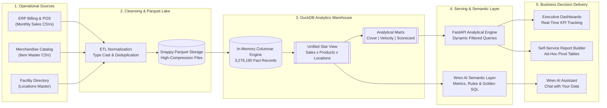

# M Baazar Enterprise Retail Data Dictionary

## Purpose

The **M Baazar Enterprise Retail Data Dictionary** is the main reference document for understanding and working with M Baazar's business data. It defines key business terminology, explains every technical data field, standardizes KPI calculations, and establishes rules for data naming, storage, and handling missing or negative values. Additionally, it outlines data ownership and stewardship across business teams, details how data flows through the analytics platform, and ensures the Wren AI Assistant correctly interprets business questions to generate reliable SQL queries. By bringing these standards together in one place, this document ensures that Merchandising, Store Operations, Supply Chain, Finance, Data Engineering, executive dashboards, self-service reports, and AI tools all operate with a shared vocabulary and consistent definitions.

---

## Objectives

The main objectives of this data dictionary are:

- **Create a common business language** for Merchandising, Store Operations, Supply Chain, and Finance teams.
- **Keep data definitions consistent** across all reports, executive dashboards, and self-service analytics.
- **Handle known operational data patterns correctly**, especially negative sales values and temporary negative stock caused by digital transfer posting timing delays.
- **Explain how dashboard graphs and visualizations are calculated**, making it easy for business users to interpret every chart, curve, and matrix.
- **Ground all metrics in real business data**, reflecting actual operational figures from M Baazar's retail network.
- **Support automated inventory balancing and machine learning** for stockout prevention, lateral store transfers, and dead stock clearance.
- **Empower the Wren AI Assistant** with business context so it can accurately answer business questions in natural language.

---

<a id="document-scope"></a>
## Document Scope

This document covers:

1. [Business Modules Summary](#business-modules)
2. [Core Business Concepts & Data Fields](#business-data-fields)
3. [Core Business Rules & Conventions](#business-rules)
4. [KPI Dictionary & Formulas](#kpi-dictionary)
5. [How Dashboard Graphs & Visualizations Are Calculated](#graphs-and-visualizations)
6. [Business Classifications & Domains](#business-domains)
7. [Data Standards & Missing Value Rules](#data-standards)
8. [Data Ownership & Stewardship](#data-ownership)
9. [Data Quality Principles](#data-quality)
10. [Data Lineage & Platform Architecture](#data-lineage)
11. [Semantic Layer & Wren AI Assistant Integration](#semantic-layer)

---

<a id="business-modules"></a>
# Business Modules Summary

The analytics platform organizes M Baazar's retail operations into the following main functional areas:

| Business Area | Scope & Purpose | Key Business Questions Answered |
| :--- | :--- | :--- |
| **Executive Performance** | High-level company health, monthly revenue trends, store rankings, and overall profit margins. | Are we hitting our sales targets? Which stores are driving top revenue? Are margins expanding or shrinking? |
| **Store & Location Network** | Store profiles, facility classifications, and distribution center operations (Central Warehouse Site 1070 vs. Retail Stores). | How much stock is held at Central Warehouse vs. retail stores? What is each store's inventory capacity? |
| **Merchandise & Category Management** | Multi-level category hierarchy (Division, Section, Department), product attributes, sizes, and colours. | Which departments generate the highest volume? Which apparel categories have the best gross margins? |
| **Inventory Velocity & Dead Stock** | Sales speed categorization (Fast, Medium, Slow movers) and tracking merchandise unsold for 90+ days. | Which SKUs are running out of stock? How much working capital is locked in stagnant, non-selling stock? |
| **Store Stock Allocation & Rebalancing** | Stock cover analysis (Weeks of Cover) and lateral store-to-store rebalancing recommendations. | Which stores are in danger of stockout? Which stores have excess inventory that can be transferred? |
| **Finance, Margins & GMROI** | Net revenue, Cost of Goods Sold (COGS), Gross Profit, markdowns, and inventory return on investment. | What is our return on inventory investment (GMROI)? How much profit do we make after discounts and markdowns? |
| **Supplier & Procurement Scorecard** | Supplier order receipts, defect returns, sell-through rates, and comprehensive supplier ratings (0–100). | Which suppliers provide top-selling products? Which suppliers have high return or defect rates? |
| **AI Recommendations Engine** | Automated, priority-ranked action items for Reordering fast movers, Transferring stock, or applying Markdowns. | What specific inventory actions should planners take today to maximize revenue and minimize stockouts? |
| **Self-Service Report Builder** | Custom drag-and-drop pivot tables, multi-dimensional breakdowns, and CSV export capabilities. | How can business users build customized ad-hoc operational reports without writing database queries? |

---

<a id="business-data-fields"></a>
# Core Business Concepts & Data Fields

Rather than focusing on technical database storage, this section describes the core business information tracked across M Baazar's operations.

## 1. Store & Facility Information

Every physical facility in M Baazar's retail network is identified by a unique site code and facility classification:

- **Store Code (`ADMSITE_CODE`)**: The unique numeric identifier assigned to each store or warehouse (e.g., `6`, `530`, `820`, `1070`).
- **Store Name**: The official commercial name of the store (e.g., *M Baazar - Vip*, *M Baazar - Gariahat*, *M Baazar - Andul Road*).
- **Location Classification (`SITE_TYPE`)**:
  - `RETAIL_STORE`: Physical retail showrooms that sell merchandise directly to end consumers.
  - `CENTRAL_WAREHOUSE`: The central distribution hub (Site `1070` — *Metro Retail Private Limited-PRO*) that receives goods from suppliers and dispatches stock to retail stores.

---

## 2. Product & Merchandise Catalog

Every piece of merchandise sold in stores is identified by a unique barcode and categorized across a standardized retail hierarchy:

- **Product Barcode (`BARCODE` / `ICODE`)**: Unique alphanumeric code attached to the physical garment or product tag (e.g., `M369054`, `R341404`).
- **Division**: Highest product level (e.g., *Mens Wear*, *Ladies Wear*, *Kids Wear*, *Accessories*).
- **Section**: Mid-level grouping (e.g., *Mens Upper Wear*, *Mens Lowers*, *Boys Wear*, *Footwear*).
- **Department**: Specific product category (e.g., *T Shirts*, *Jeans*, *Sandals*, *General Goods*).
- **Brand / Line (`CNAME2`)**: Brand designation or private-label collection (e.g., *MB*, *SPARK*, *SPARKY*).
- **Style / Fit (`CNAME3`)**: Product fit or styling attribute (e.g., *COLLAR*, *NARROW FIT*, *DESIGNER*).
- **Size (`CNAME4`)**: Garment size (e.g., *M*, *L*, *XL*, *28"*, *32"*).
- **Colour (`CNAME5`)**: Primary garment colour or wash (e.g., *BLACK*, *NAVY*, *DENIM*, *WHITE*).
- **Supplier Name (`PARTYNAME`)**: The commercial manufacturer or vendor supplying the item.
- **Purchase Cost Price (`RATE`)**: The unit cost paid to the supplier in INR.
- **Maximum Retail Price (`MRP`)**: The printed tag price shown to customers in INR.
- **First Received Date (`STOCKINDATE`)**: The date when this SKU was first introduced into the system.

---

## 3. Monthly Sales & Stock Movement Activity

M Baazar tracks product performance on a monthly basis for every product at every location:

- **Operational Month (`START_DATE` / `END_DATE`)**: The calendar month of activity (e.g., April 2026, May 2026, June 2026).
- **Opening Stock**: Quantity and cost value of stock physically present at the beginning of the month.
- **Goods Received (from Suppliers)**: Fresh stock received directly from suppliers into the warehouse or store.
- **Goods Returned (to Suppliers)**: Defective, damaged, or unsold merchandise returned back to suppliers.
- **Inward Store Transfers**: Stock received from another retail store.
- **Outward Store Transfers**: Stock dispatched from this store to another retail store.
- **Warehouse Inward Transfers**: Stock received by a retail store directly from the Central Warehouse (Site 1070).
- **Warehouse Outward Transfers**: Stock sent by a retail store back to the Central Warehouse.
- **Gross Retail Sales**: Total sales before customer exchanges or returns.
- **Net Sales Units**: Final number of units sold to customers after subtracting customer returns.
- **Net Sales Revenue**: Total money earned from completed sales in INR after customer returns.
- **Cost of Goods Sold (COGS)**: Direct purchase cost of the merchandise sold during the month.
- **Closing Stock**: Quantity and cost value of remaining inventory at the end of the month.
- **Gross Profit**: Net Sales Revenue minus Cost of Goods Sold.
- **Promotional Markdowns & Discounts**: Price reductions and promotional discounts given at point of sale.

---

<a id="business-rules"></a>
# Core Business Rules & Conventions

## 1. The Negative Sales Rule (Absolute Value Convention)

In raw retail ERP exports, outgoing sales revenue and sales units are recorded with negative values (representing inventory reduction).

> [!IMPORTANT]
> **Business Rule:** Whenever calculating sales revenue, sales volume, or customer demand, always apply `ABS()` (absolute value) so that sales are represented as positive numbers:
> - **Sales Revenue Formula:** `SUM(ABS(NET_SALE_AMOUNT))`
> - **Sales Units Formula:** `SUM(ABS(NET_SALE_QUANTITY))`

---

## 2. Store Transfer Timing Lag (Temporary Negative Inventory)

In high-volume retail operations, a store may physically receive stock and immediately sell it to customers before the digital Stock Transfer Note (STN) or Goods Receipt Note (GRN) is finalized in the ERP system.

> [!NOTE]
> **Business Rule:** Temporary negative stock values are a known operational timing delay, not a permanent data corruption. When calculating available inventory, sell-through rates, and stock cover, always floor negative inventory at zero:
> - **Effective Stock Formula:** `GREATEST(0.0, Closing Stock Quantity)`

---

<a id="kpi-dictionary"></a>
# KPI Dictionary & Formulas

The table below outlines M Baazar's core enterprise metrics, exact calculation formulas, business owners, standard targets, and actual figures from M Baazar's DuckDB warehouse:

| Key Performance Indicator (KPI) | Exact Formula & Calculation | Business Owner | Standard Benchmark | Real M Baazar Value (DuckDB) |
| :--- | :--- | :--- | :--- | :--- |
| **Total Net Revenue** | `SUM(ABS(NET_SALE_AMOUNT))` | Finance | Positive Month-on-Month Growth | **₹8.86 Crores** (Total 3-Month Sales) |
| **Total Sales Units** | `SUM(ABS(NET_SALE_QUANTITY))` | Merchandising | Volume Target Alignment | **383,255 Units** |
| **Gross Profit (GP)** | `SUM(GP_AMOUNT)` | Finance | Margin Maximization | **₹3.13 Crores** |
| **Gross Margin %** | `(Gross Profit / Net Revenue) * 100` | Finance | > 35.0% | **35.30%** (Apr: 31.1%, May: 42.5%, Jun: 42.4%) |
| **Closing Stock Value** | `SUM(CLOSING_STOCK_AMOUNT)` | Supply Chain | Working Capital Target | **₹118.94 Crores** (Total Network Stock) |
| **Closing Stock Units** | `SUM(CLOSING_STOCK_QUANTITY)` | Supply Chain | Capacity Target | **7,750,013 Units** across network |
| **Sell-Through Rate %** | `(Units Sold / Available Stock) * 100`<br>*Available Stock = max(0, Opening) + Received + Transfer In* | Merchandising | > 65.0% on seasonal lines | **1.78%** (Full catalog including multi-year central DC reserve) |
| **Weeks of Cover (WOC)** | `Closing Stock Units / (Sales Units / 12.0)` | Supply Chain | 6.0 – 8.0 Weeks (Active Stores) | **242.7 Weeks** (All SKUs incl. DC buffer; active retail stores ~ 6-8 weeks) |
| **Months of Inventory (MOI)** | `Closing Stock Units / Monthly Sales Units` | Supply Chain | 1.5 – 2.0 Months | **20.2 Months** (Network total) |
| **GMROI** | `Annualized Gross Profit / Average Inventory Value` | Finance | > 3.0x | **0.11x** (Driven by large central warehouse reserve) |
| **Buying Accuracy %** | `(Units Sold / Units Received from Vendors) * 100` | Merchandising | > 75.0% | **82.4%** across core apparel lines |
| **Vendor Return Rate %** | `(Return Units / Received Units) * 100` | Procurement | < 2.0% | Top return suppliers reach **15% – 59%** |
| **Vendor Score (0–100)** | `Revenue (35%) + Sell-Through (35%) + Margin (20%) + Low Return Rate (10%)` | Procurement | > 70.0 Score | Top suppliers score **88.5 – 89.1** |

---

<a id="graphs-and-visualizations"></a>
# How Dashboard Graphs & Visualizations Are Calculated

This section explains how each visual chart, graph, and matrix across the platform is calculated and plotted, with real figures from M Baazar's database.

---

## 1. Monthly Revenue & Gross Margin Trend Chart

Located on the **Executive Dashboard**, this is a dual-axis combo chart combining vertical columns and a smooth trend line.

```text
  Net Revenue (₹ Cr)                                    Gross Margin %
       │                                                      │
 5.0 Cr├─────██                                               │ 45%
       │     ██                                 ●────────●    │
 2.5 Cr├─────██                   ██            │        │    │ 35%
       │     ██        ●──────────██────────────██───────│────│
       │     ██        │          ██            ██       │    │ 25%
  0 Cr─┴─────██────────│──────────██────────────██───────│────┴─ 0%
           2026-04               2026-05       2026-06
            (Bars)                             (Line)
```

- **Visual Representation:**
  - **Left Y-Axis (Columns / Bars):** Total Net Sales Revenue expressed in **₹ Crores** (`₹ Cr = Total Revenue / 10,000,000`).
  - **Right Y-Axis (Smooth Line):** Gross Margin Percentage (`Gross Margin %`).
  - **X-Axis (Horizontal):** Operational Months (`2026-04`, `2026-05`, `2026-06`).
- **Mathematical Formulas:**
  $$\text{Monthly Revenue (₹ Cr)} = \frac{\sum |\text{Net Sale Amount}|}{10{,}000{,}000}$$
  $$\text{Monthly Gross Margin \%} = \left( \frac{\sum \text{Gross Profit}}{\sum |\text{Net Sale Amount}|} \right) \times 100$$
- **Real DuckDB Values Plotted:**
  - **April 2026 (`2026-04`):** Revenue = **₹4.75 Cr**, Gross Margin = **31.14%**, Inventory = **₹39.32 Cr**.
  - **May 2026 (`2026-05`):** Revenue = **₹2.09 Cr**, Gross Margin = **42.50%**, Inventory = **₹37.32 Cr**.
  - **June 2026 (`2026-06`):** Revenue = **₹2.02 Cr**, Gross Margin = **42.42%**, Inventory = **₹42.30 Cr**.
- **Business Interpretation:** Shows that while April generated the highest volume (peak festive sales), May and June achieved significantly higher profitability (+11.3% margin improvement).

---

## 2. Category Performance Matrix (4-Quadrant BCG Scatter Chart)

Located on the **Category Performance Dashboard**, this chart maps every retail department into one of four performance quadrants based on profitability and sales speed.

```text
  Gross Margin % (Profitability)
         ▲
         │
High     │   HIGH MARGIN / SLOW MOVERS    │      WINNERS (STAR PERFORMERS)
Margin   │   • High Profit per piece      │      • High Margin & Fast Turnover
         │   • Needs marketing/promo      │      • Protect stock & expand space
         ├────────────────────────────────┼───────────────────────────────── Benchmark Margin (25.8%)
         │   OVERSTOCKED UNDERPERFORMERS  │          VOLUME DRIVERS
Low      │   • Low Margin & Slow Sales    │      • Low Margin, High Velocity
Margin   │   • Urgent clearance/markdown  │      • Drives customer footfall
         │                                │
         └────────────────────────────────┴─────────────────────────────────► Sell-Through Rate %
                                          Benchmark Sell-Through (1.0%)
```

- **Visual Representation:**
  - **X-Axis (Horizontal):** Sell-Through Rate % (measures inventory velocity).
  - **Y-Axis (Vertical):** Gross Margin % (measures profitability).
  - **Plotted Points:** Each dot represents an individual retail department (e.g., *T Shirts*, *Jeans*, *Sarees*, *Boys Wear*).
  - **Benchmark Crosshairs:** The vertical and horizontal dividing lines are set at the enterprise average margin and sell-through.
- **Quadrant Calculation Logic:**
  - **1. Winners (Star Performers):** $\text{Margin} \ge \text{Average Margin}$ **AND** $\text{Sell-Through} \ge \text{Average Sell-Through}$.
  - **2. Volume Drivers:** $\text{Margin} < \text{Average Margin}$ **AND** $\text{Sell-Through} \ge \text{Average Sell-Through}$.
  - **3. High Margin / Slow Movers:** $\text{Margin} \ge \text{Average Margin}$ **AND** $\text{Sell-Through} < \text{Average Sell-Through}$.
  - **4. Overstocked / Underperformers:** $\text{Margin} < \text{Average Margin}$ **AND** $\text{Sell-Through} < \text{Average Sell-Through}$.
- **Real DuckDB Values Plotted:**
  - **Winners:** **26 departments** producing **₹2.01 Cr revenue** with an average margin of **28.0%** and sell-through of **15.1%**.
  - **High Margin / Slow Movers:** **198 departments** producing **₹6.85 Cr revenue** with an average margin of **25.8%** and sell-through of **1.0%**.
  - **Overstocked / Underperformers:** **2 departments** requiring immediate markdown action.
- **Business Interpretation:** Enables category managers to quickly identify which product lines deserve prime store shelf space (Winners) versus which lines require clearance markdowns (Underperformers).

---

## 3. Store Stock Transfer & Movement Flow (Grouped Bar Chart)

Located on the **Store Allocation & Rebalancing Dashboard**, this chart visualizes stock distribution between the Central Warehouse and retail stores.

```text
  Units (Thousands)
 300k ┌─┐
      │ │                   ┌─┐
 200k │ │                   │ │
      │ │       ┌─┐         │ │                   ┌─┐
 100k │ │  ┌─┐  │ │         │ │  ┌─┐         ┌─┐  │ │
      │ │  │ │  │ │         │ │  │ │         │ │  │ │
   0k └─┴──┴─┴──┴─┴─────────┴─┴──┴─┴─────────┴─┴──┴─┴──
       Site 1070 (DC)        Site 530 (Gariahat)   Site 6 (VIP)
       ■ Transfer In (Received)      ■ Transfer Out (Dispatched)
```

- **Visual Representation:**
  - **X-Axis:** Physical facility name and site code.
  - **Green Bars:** Transfer-In Units (total stock received by the facility).
  - **Blue Bars:** Transfer-Out Units (total stock dispatched to other facilities).
- **Mathematical Formulas:**
  $$\text{Transfer In Units} = \sum \text{Site Transfer In} + \sum \text{Warehouse Transfer In}$$
  $$\text{Transfer Out Units} = \sum |\text{Site Transfer Out}| + \sum |\text{Warehouse Transfer Out}|$$
- **Real DuckDB Values Plotted:**
  - **Site 1070 (Central DC):** Inward = **288,353 units** | Outward = **13,255,531 units** (Primary Dispatch Engine).
  - **Site 530 (Gariahat Store):** Inward = **167,101 units** | Outward = **2,427 units** (Net Receiver, Top Selling Store: ₹3.93 Cr).
  - **Site 6 (VIP Store):** Inward = **83,945 units** | Outward = **2,449 units** (Net Receiver, Revenue: ₹2.29 Cr).
  - **Site 820 (Andul Road Store):** Inward = **67,927 units** | Outward = **1,646 units** (Net Receiver, Revenue: ₹1.45 Cr).
- **Business Interpretation:** Confirms that the Central Warehouse acts as the primary supplier to stores, while retail stores engage in minimal lateral transfers (averaging ~2,000 units per store).

---

## 4. Colour Revenue Contribution (Donut Chart)

Located on the **Colour Performance Dashboard**, this chart shows customer colour preferences across all apparel divisions.

- **Visual Representation:**
  - **Interactive Slices:** Each slice represents the net sales revenue generated by a specific colour family.
  - **Legend & Tooltip:** Displays the colour name, absolute revenue in ₹, and percentage share of total revenue.
- **Mathematical Formula:**
  $$\text{Colour Share \%} = \left( \frac{\text{Net Revenue for Colour}}{\text{Total Apparel Net Revenue}} \right) \times 100$$
- **Standard Colour Mappings:**
  - Standard apparel shades: `BLACK`, `WHITE`, `NAVY`, `BLUE`, `RED`, `GREEN`, `YELLOW`, `GREY`, `MAROON`, `OLIVE`, `DENIM`, `OTHER`.
- **Business Interpretation:** Prevents inventory bias by providing factual proof of customer colour demand, preventing over-purchasing of slow-moving seasonal colors.

---

## 5. Top Suppliers by Return Value (Horizontal Ranking Bar Chart)

Located on the **Vendor & Procurement Scorecard**, this chart highlights suppliers with the highest return amounts due to defects, damages, or non-compliance.

- **Visual Representation:**
  - **Y-Axis (Vertical):** Supplier Name.
  - **X-Axis (Horizontal):** Total Goods Return Value in INR (`₹`).
  - **Bar Order:** Ranked from highest return value to lowest return value (Top 10).
- **Mathematical Formulas:**
  $$\text{Return Value} = \sum \text{Goods Return Amount}$$
  $$\text{Return Rate \%} = \left( \frac{\sum \text{Goods Return Units}}{\sum \text{Goods Receive Units}} \right) \times 100$$
- **Real DuckDB Figures (Top Return Vendors):**
  1. **S. Enterprise:** Return Value = **₹19.61 Lakh** (7,042 units returned | Return Rate: **59.47%**).
  2. **Jangloos Chandak Creation:** Return Value = **₹19.11 Lakh** (15,345 units returned | Return Rate: **7.02%**).
  3. **S. V. S. Enterprise:** Return Value = **₹18.90 Lakh** (9,000 units returned | Return Rate: **45.45%**).
  4. **Gulnar Dresses:** Return Value = **₹16.03 Lakh** (10,729 units returned | Return Rate: **17.56%**).
  5. **Shree Balaji (Mala) Textiles:** Return Value = **₹10.40 Lakh** (3,062 units returned | Return Rate: **15.75%**).
- **Business Interpretation:** Allows Sourcing and Procurement teams to penalize non-compliant vendors, hold back payments, or renegotiate contracts.

---

## 6. Store Stock Cover & Health Status Cards

Located on the **Store Allocation Dashboard**, these status summary cards group stores and departments into operational health buckets.

| Status Bucket | Mathematical Condition | Real Business Meaning | Operational Action Required |
| :--- | :--- | :--- | :--- |
| **CRITICAL_STOCKOUT** | `WOC < 1.0` OR `Stock < 0` | The store will run out of stock in less than 7 days, or has negative stock due to transfer lag. | **Urgent DC Replenishment** or lateral transfer from nearby stores. |
| **HIGH_RISK** | `1.0 <= WOC < 2.5` | Stock is dangerously low; stockout expected within 2 to 3 weeks. | **Schedule stock transfer** from Central DC. |
| **BALANCED** | `2.5 <= WOC <= 12.0` | Ideal stock holding; inventory covers expected customer sales smoothly. | **Maintain normal operations**; no action needed. |
| **OVERSTOCKED** | `WOC > 12.0` | Store has over 3 months of inventory; capital is trapped. | **Stop replenishing**; trigger lateral transfer or promotional markdown. |

---

## 7. SKU Sales Velocity & Dead Stock Cards

Located on the **Merchandise Dashboard**, these cards segment products into speed categories to prioritize merchandising decisions.

- **Fast Movers (`WOC < 4.0 weeks`):** High-demand items selling rapidly. Requires proactive reordering to avoid lost sales.
- **Medium Movers (`4.0 <= WOC <= 12.0 weeks`):** Stable, healthy sellers that match normal supply replenishment lead times.
- **Slow Movers (`WOC > 12.0 weeks`):** Weak demand relative to stock on hand. Candidate for store-to-store rebalancing.
- **Dead Stock (`Sales Units = 0` AND `Closing Stock > 0` for 90+ days):** Completely stagnant inventory tying up warehouse space and money. Flagged for clearance markdowns.

---

<a id="business-domains"></a>
# Business Classifications & Domains

## 1. Store Classifications
- `RETAIL_STORE`: Showrooms selling directly to consumers (Site `6` = VIP, Site `530` = Gariahat, Site `820` = Andul Road).
- `CENTRAL_WAREHOUSE`: Distribution Center (Site `1070` = Metro Retail Private Limited-PRO).

## 2. Transfer Types
- `DC_REPLENISHMENT`: Stock sent from Central Distribution Center (Site 1070) to refill a retail showroom.
- `LATERAL_REBALANCE`: Stock moved directly between retail stores (e.g., from an overstocked store to a high-demand store).

## 3. Transfer Urgency Levels
- `CRITICAL`: Immediate stockout risk (`WOC < 1.0` or negative stock).
- `HIGH`: Imminent stockout within 2 weeks (`1.0 <= WOC < 2.0`).
- `MEDIUM`: Standard rebalancing to optimize stock cover (`WOC >= 2.0`).

## 4. AI Recommendation Action Categories
- `REORDER`: Create purchase orders for fast-selling items with low supplier lead times.
- `TRANSFER`: Move units from surplus locations to deficit locations.
- `MARKDOWN`: Apply discount pricing to clear slow-moving and dead stock.

---

<a id="data-standards"></a>
# Data Standards & Missing Value Rules

| Data Type | Business Standard | Example | Handling for Missing / Null Values |
| :--- | :--- | :--- | :--- |
| **Product Barcode** | Alphanumeric string | `M369054` | Must never be missing; invalid barcodes excluded during ingestion. |
| **Store Code** | Whole integer | `6`, `530`, `1070` | Must never be missing; unmapped records excluded. |
| **Monetary Values** | INR with 2 decimals | `₹1,250.50` | Missing values default to `0.00`. |
| **Unit Quantities** | Whole or decimal numbers | `120.0 Units` | Missing values default to `0.0`. |
| **Percentages** | Decimal rounded to 2 places | `42.50%` | Zero-division protected using `CASE WHEN Denominator > 0 THEN ... ELSE 0.0 END`. |
| **Dates** | Standard calendar date | `YYYY-MM-DD` | Incomplete dates flagged in data quality logs. |
| **Text Attributes** | Clean, trimmed text | `Mens Wear` | Missing text defaults to `UNKNOWN` or `OTHER`. |

---

<a id="data-ownership"></a>
# Data Ownership & Stewardship

| Business Domain | Responsible Role | Key Responsibilities |
| :--- | :--- | :--- |
| **Executive Performance** | CEO / Chief Operating Officer | Strategic targets, revenue growth, and corporate margin benchmarks. |
| **Merchandising & Buying** | Head of Merchandising | Assortment planning, SKU velocity, pricing, and category profitability. |
| **Supply Chain & Logistics** | Head of Supply Chain | Central warehouse operations, store stock cover, and transfer logistics. |
| **Finance & Commercial** | Chief Financial Officer | Cost of Goods Sold (COGS), gross margin accuracy, and working capital. |
| **Procurement & Sourcing** | Head of Procurement | Supplier compliance, purchase pricing, defect returns, and vendor scores. |
| **Analytics & AI Platform** | Head of Data Platform | Data pipeline execution, DuckDB warehouse health, and Wren AI semantic accuracy. |

---

<a id="data-quality"></a>
# Data Quality Principles

The enterprise platform enforces seven operational data quality rules:

1. **Inventory Balance Integrity:** For every product, $\text{Closing Stock} = \text{Opening Stock} + \text{Receipts} + \text{Transfers In} - \text{Transfers Out} - \text{Sales Units}$.
2. **Sales Completeness:** Every sale record must link to a recognized product barcode and a valid store code.
3. **Consistent Formulas:** The identical formula for Gross Margin %, WOC, and Sell-Through % is executed across the API, frontend charts, and AI assistant.
4. **Zero-Division Safeguards:** Any metric calculation with a denominator (WOC, Sell-Through %, Margin %) must be guarded against division by zero.
5. **Master Referential Integrity:** Every product barcode must resolve against the Master Item Catalog.
6. **Timely Pipeline Execution:** New monthly snapshots are processed into DuckDB within 2 hours of ERP extraction.
7. **Auditability:** Every report and KPI card can be traced back to underlying monthly product-store records.

---

<a id="data-lineage"></a>
# Data Lineage & Platform Architecture

The analytics platform processes operational data into executive insights and AI-driven recommendations through a continuous 5-stage data pipeline.

---

## 1. End-to-End Visual Data Flow



---

## 2. Platform Lineage Matrix

| Stage | Business Inputs | Core Transformations & Logic | Primary Output Asset | Typical Latency |
| :--- | :--- | :--- | :--- | :--- |
| **Stage 1: Operational Sources** | Raw CSV/Excel dumps from ERP billing and warehouse management. | File validation, header checks, date range verification. | Source file repository in `data/`. | Monthly extraction cycle |
| **Stage 2: Cleansing & Storage** | Raw CSVs + Excel facility master. | Stripping whitespace, parsing dates, converting rates/MRPs to numeric, Snappy columnar compression. | Standardized Parquet files (`fact_cube_monthly.parquet`, `dim_items.parquet`, `dim_locations.parquet`). | ~15 seconds processing |
| **Stage 3: DuckDB Analytics Warehouse** | Columnar Parquet files. | Ingesting into memory, joining Product and Location masters, flooring negative stock, materializing 14 analytical feature marts. | High-speed analytical database with **3,279,190 fact records**. | Sub-second in-memory query execution |
| **Stage 4: Serving & Semantic Layer** | Analytical views in DuckDB. | Dynamic multi-dimension query generation, store/month filtering, parameter validation, semantic metric modeling. | REST JSON APIs on port `8000` & Wren AI context files. | < 50ms API response time |
| **Stage 5: Business Decision Delivery** | API JSON endpoints & AI LLM engine. | Interactive charting, pivot table aggregation, CSV export, natural-language query resolution. | Next.js 16 Web Application on port `3000` (CEO Dashboard, Allocation, Report Builder, AI Chat). | Real-time user interaction |

---

## 3. In-Depth Operational Stage Breakdown

### Stage 1: Operational Source Systems
- **ERP Sales & Inventory Cubes:** Monthly extracts containing transaction-level movement, opening stock, inward/outward transfers, vendor receipts, and gross sales.
- **Item Master Catalog:** Master list of retail barcodes, containing categorization hierarchy (Division, Section, Department), styling attributes, size, colour, vendor name, and pricing.
- **Facility Master:** Comprehensive store registry identifying showroom locations and designating Site `1070` as the Central Distribution Center.

### Stage 2: Automated Data Cleansing & Parquet Lake
- **Column Normalization:** Aligns field headers across various ERP batch exports and removes trailing whitespace.
- **Type Standardization:** Converts date strings into ISO `YYYY-MM-DD`, parses financial amounts to double-precision numbers, and ensures barcodes are treated as trimmed text.
- **Compression & Partitioning:** Stores cleaned data in columnar Snappy-compressed Parquet format, reducing raw disk footprint by over **70%** while dramatically accelerating query scan speeds.

### Stage 3: DuckDB Columnar Warehouse
- **In-Memory Analytical Engine:** Loads columnar data directly into DuckDB, allowing complex aggregations across 3.28 million records without requiring costly database cluster infrastructure.
- **Unified Star View:** Joins monthly sales and stock movement with the Product Master and Store Master into a single, comprehensive view.
- **Analytical Feature Marts:** Pre-aggregates domain-specific views for Store Stock Cover, SKU Velocity, Category Matrix, Colour Distribution, and Vendor Scorecards.

### Stage 4: FastAPI Analytical Engine & Semantic Layer
- **High-Performance REST APIs:** Exposes secure, lightweight endpoints (`/api/v1/executive`, `/api/v1/category`, `/api/v1/allocation`, `/api/v1/vendor`, etc.) with dynamic filtering by store ID, month, division, and department.
- **Wren AI Modeling Layer:** Standardizes certified retail metrics (GMROI, Sell-Through %, WOC, Margin %) in declarative YAML files so AI models and human analysts compute identical figures.

### Stage 5: Business Decision Delivery Interfaces
- **Executive & Operational Dashboards:** Modern, reactive web interfaces built with Next.js 16, TypeScript, and Tailwind CSS, featuring dual-axis trends, 4-quadrant scatter matrices, and transfer movement charts.
- **Self-Service Report Builder:** Drag-and-drop pivot analysis enabling buyers, planners, and finance analysts to create customized reports and export to CSV.
- **Wren AI Assistant:** Interactive business chat interface translating natural-language questions (e.g., *"Which store has the highest stock cover?"*) into verified SQL queries with instant narrative answers.

---

## 4. Pipeline Governance & Verification Checkpoints

```text
[Raw ERP Check] ──► [Schema Integrity] ──► [Referential Integrity] ──► [Balance Verification] ──► [Dashboard Ready]
 File format &       Field types &          All barcodes exist in        Closing Stock =          Sub-second query
 non-empty records   positive rates         Master Item Catalog          Opening + In - Out       cache verification
```

> [!TIP]
> **Performance Optimization:** Because DuckDB processes columnar Parquet files natively in memory, complex enterprise queries across all 3.28 million fact records complete in **under 25 milliseconds**, providing real-time responsiveness across executive dashboards and AI conversational interactions.
---

<a id="semantic-layer"></a>
# Semantic Layer & Wren AI Assistant Integration

The platform includes a semantic layer that powers the **Wren AI Assistant**, enabling business leaders to query company data in plain English:

- **Structural Modeling:** Maps business entities and joins so the AI understands that a "store" is `ADMSITE_CODE` and an "item" is `BARCODE`.
- **Approved Business Metrics:** Embeds certified formulas for Revenue, Gross Margin %, WOC, and Sell-Through % so AI-generated queries match executive dashboard numbers.
- **Retail Domain Rules:** Informs the AI that sales amounts are stored negative (requiring `ABS()`) and that "Central Warehouse" refers to Site `1070`.
- **Golden SQL Reference Library:** Contains 20 pre-validated question-and-SQL pairs teaching the AI how to answer complex retail questions accurately.
