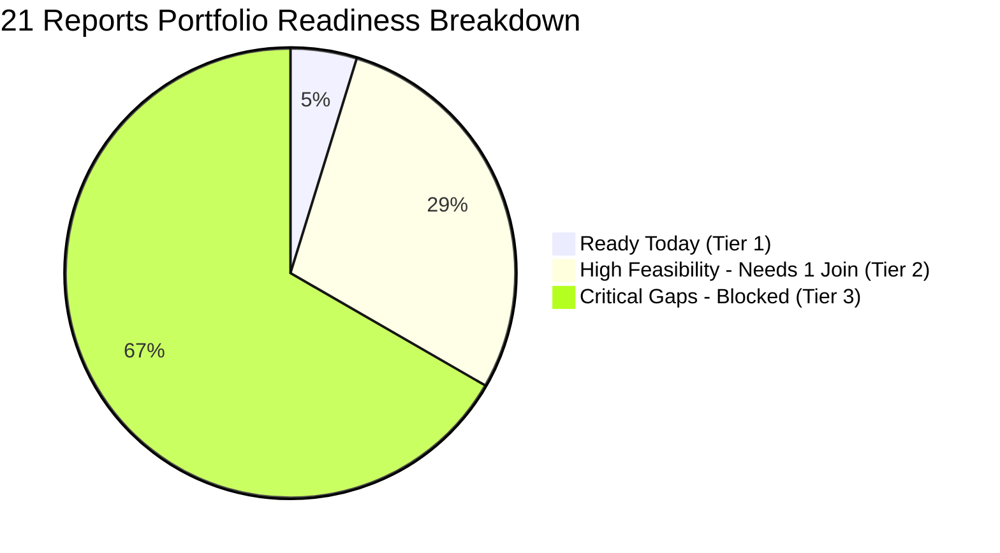

# Retail Data Gap Analysis: Executive Summary Report
## 200 Rows × 24 Columns Store Inventory Snapshot vs. 21 Enterprise Business Reports

**Auditing Standard:** Strict Metric-by-Metric Fitment: $\text{Score} = \frac{\text{Matched} + 0.5 \times \text{Derivable}}{\text{Total Required Metrics}} \times 100$  
**Scope:** 21 Business Reports across 6 Enterprise Verticals | **Source Snapshot:** 200 Rows × 24 Columns SOH, Lifecycle & Valuation Dataset  
**Portfolio Feasibility:** **27.5%** (36 Matched, 5 Derivable, 99 Missing out of 140 Evaluated Metrics)

> [!IMPORTANT]
> **Executive Verdict:** Out of 21 business reports requested, **1 Report is 100% operational today**, **6 Reports can be unlocked immediately with just 1 external join** (POS daily sales or physical audit scans), and **14 Reports are blocked** pending upstream transactional platforms. 

---

## 1. Portfolio Readiness at a Glance

| Status Tier | Report Count | Feasibility Range | Operational Status | Strategic Action |
| :--- | :---: | :---: | :--- | :--- |
| 🟢 **Tier 1: Ready to Deploy** | **1** (4.8%) | **100.0%** | Production Ready | Deploy automated inventory aging & broken-set reporting today. |
| 🟡 **Tier 2: High Feasibility** | **6** (28.6%) | **33.3% – 57.1%** | Blocked by 1 Join | Connect POS cash desk or HHT scans to unlock 6 key operational reports. |
| 🔴 **Tier 3: Critical Gaps** | **14** (66.7%) | **0.0% – 28.6%** | Requires Net-New Feeds | Prioritize pipeline integrations (ERP Purchase Orders, 3PL carrier APIs, CRM). |
| **Total Portfolio** | **21 Reports** | **27.5% Avg** | **38.5 / 140 Metrics Feasible** | **Overall Portfolio Feasibility: 27.5%** |



---

## 2. All 21 Reports Ranked by Readiness

```text
🟢 Tier 1: 100% Operational Today
Report 16 [████████████████████] 100.0% | 16. Inventory Aging & Broken Size-Set Report

🟡 Tier 2: Unlocked with 1 External Join
Report 05 [███████████░░░░░░░░░]  57.1% | 05. Store Replenishment Planning (Needs: Daily POS Units Sold)
Report 15 [███████████░░░░░░░░░]  55.6% | 15. Item & Department Performance (Needs: POS Billed Units)
Report 19 [██████████░░░░░░░░░░]  50.0% | 19. Stock Audit & Shrinkage Variance (Needs: Physical Scans)
Report 10 [████████░░░░░░░░░░░░]  42.9% | 10. Store Stock Return / RTO / RTV (Needs: Return Memo No)
Report 21 [████████░░░░░░░░░░░░]  41.7% | 21. Master Executive Report (Needs: Billed Network GMV)
Report 09 [███████░░░░░░░░░░░░░]  33.3% | 09. Inter-Store Transfer & Balancing (Needs: Transfer Qty)

🔴 Tier 3: Critical Gaps (Requires Upstream System Integrations)
Report 11 [██████░░░░░░░░░░░░░░]  28.6% | 11. Monthly Store Sales Target Report
Report 01 [█████░░░░░░░░░░░░░░░]  25.0% | 01. Purchase Planning Report (OTB)
Report 06 [█████░░░░░░░░░░░░░░░]  25.0% | 06. Sale Stock Transit Package Report
Report 08 [████░░░░░░░░░░░░░░░░]  21.4% | 08. Goods Loss / Shortage Received at Store
Report 02 [███░░░░░░░░░░░░░░░░░]  14.3% | 02. PO & Goods Receive (GRN) Report
Report 07 [███░░░░░░░░░░░░░░░░░]  14.3% | 07. Store Transit Report with TAT
Report 13 [███░░░░░░░░░░░░░░░░░]  14.3% | 13. Target Achieved & Incentive Distribution
Report 12 [███░░░░░░░░░░░░░░░░░]  12.5% | 12. Store Sales Report with Master Fields
Report 17 [███░░░░░░░░░░░░░░░░░]  12.5% | 17. Store Performance Scorecard
Report 04 [░░░░░░░░░░░░░░░░░░░░]   0.0% | 04. Stock Conversion Report
Report 03 [░░░░░░░░░░░░░░░░░░░░]   0.0% | 03. Vendor Performance Report
Report 14 [░░░░░░░░░░░░░░░░░░░░]   0.0% | 14. Comparison Report (Festive / Calendar Match)
Report 18 [░░░░░░░░░░░░░░░░░░░░]   0.0% | 18. Promotion & Discount Effectiveness Report
Report 20 [░░░░░░░░░░░░░░░░░░░░]   0.0% | 20. Customer Sales & Loyalty Report
```

---

## 3. The 3 Actionable Tiers & What to Do

### 🟢 Tier 1: 100% Operational Today (1 Report)

| Report | What We Have in Dataset | Output / Business Value Delivered |
| :--- | :--- | :--- |
| **16. Inventory Aging & Broken Size-Sets** | • Store (`GRHAT`, `SLCHR`, `BBSR`, `BRHMPR C`)<br>• Full Taxonomy (`Kids`, `Ladies`, `Mens`, etc.)<br>• Style & Sizing (`M`, `L`, `XL`, `16-22"`)<br>• Inward Dates (`18-May-24` to `Jul-25`)<br>• Expiry Dates (`29-Apr-25` to `Sep-26`)<br>• Dual Cost & Retail MRP Valuations | **Immediate automated inventory risk control:**<br>• Automatically segments inventory into `0-30`, `31-60`, `61-90`, and `90+` day aging brackets.<br>• Flags expired or near-expiry batches across stores.<br>• Pinpoints broken size sets (`Stock_Qty < 3`) across apparel styles to prevent store markdowns. |

---

### 🟡 Tier 2: Unlocked with Just 1 External Join (6 Reports)

| Report | Fit % | Already Matched in Dataset | Single Missing Piece to Unlock | Upstream Source |
| :--- | :---: | :--- | :--- | :--- |
| **05. Store Replenishment** | **57.1%** | Store ID, SKU Style, SOH Qty, Size Curve, Route Tag (`RT 01-04`) | Daily billed sales units to compute Rate of Sale (ROS). | POS Line Items |
| **15. Item & Dept Performance** | **55.6%** | Dept, Sub-Cat, Style Code, SOH Qty, Cost & Retail Valuation | Realized units billed to compute Sell-Through Rate (STR %). | POS Transactions |
| **19. Stock Audit & Shrinkage** | **50.0%** | Store ID, Dept, System Book Stock (`Stock_Qty`), Landed Unit Cost | Physical barcode scan dump to compute piece variance (+/-). | Handheld Scanners (HHT) |
| **10. Store Stock Return (RTV)** | **42.9%** | Store ID, Full Item Details, SOH Qty, Expiry Dates (`29-Apr-25`) | Reverse logistics authorization memo number and reason code. | WMS Return Module |
| **21. Master Executive Report** | **41.7%** | Holding Cost (₹19.4L), MRP (₹35.2L), Store Count (4), Margins (45.3%) | Total realized gross revenue (GMV) from store cash desks. | POS Sales Summary |
| **09. Inter-Store Transfer** | **33.3%** | Source Store, Style Code, SOH Qty across 4 regional cluster stores | Merchandiser target transfer quantities and deficit store assignment. | Allocation Engine |

---

### 🔴 Tier 3: Blocked Pending Net-New Systems (14 Reports)

| Report Name (# & Title) | Fit % | Already Matched in Dataset | Critical Missing Fields | Prerequisite Upstream System |
| :--- | :---: | :--- | :--- | :--- |
| **11. Monthly Store Sales Target** | **28.6%** | Store Code, Regional Zone (`WEST BEN`) | Target Sales (₹), Carpet Area (SPSF), Prior Year Sales (LY), Growth % | Retail Operations Sales Budget & Store Master |
| **01. Purchase Planning Report (OTB)** | **25.0%** | Category & Sub-Category, Actual SOH Cost | OTB Budget (₹), Target GMV, Supplier Lead Time, MOQ | Merchandising Financial Plan & Vendor Contracts |
| **06. Sale Stock Transit Packages** | **25.0%** | Destination Store, CDC Hub, Packaging Type | Dispatch Delivery Challan No, Serialized Carton Barcode ID, Carrier Status | WMS Dispatch Gate-Out & 3PL Logistics Portal |
| **08. Goods Shortage at Store** | **21.4%** | Store Code, Unit Cost & MRP Base | Challan Dispatched Qty, Gate Physical Scanned Count, Damage Log, Carrier Claim | Store Gate Inward Audit & Transporter Claim System |
| **02. PO & Goods Receive (GRN)** | **14.3%** | GRN Lot Quantity (`Stock_Qty`) | Purchase Order No, Vendor Name, Ordered PO Qty, Pending Qty, Open PO Aging | ERP Purchasing Module (`po_headers`, `po_lines`) |
| **07. Store Transit Report with TAT** | **14.3%** | Store Gate Inward Date (`Inward_GRN_Date`) | Lorry Receipt (Docket/LR No), Transporter Name, CDC Gate-Out Date, SLA TAT | Logistics Management System (LMS) & Carrier Manifests |
| **13. Target & Incentive Distribution** | **14.3%** | Store Code | Employee Code, Monthly Sales Quota, Cashier Billed Sales, Incentive Slab | HRMS Staff Roster & POS Cashier Attribution |
| **12. Store Sales Master Report** | **12.5%** | Store Code, Product Hierarchy | Bill Count, Net Revenue, ATV, UPT, Tender Split (Cash/UPI/Card), Footfall | POS Billing Cash Desk & Footfall Cameras |
| **17. Store Performance Scorecard** | **12.5%** | Regional Hub, Store SOH Capital Base | Store Rank, Like-for-Like Growth (SSSG %), SPSF, 4-Wall Operating Margin % | Corporate Finance P&L & Store Carpet Area Master |
| **04. Stock Conversion Report** | **0.0%** | Converted Packaging Standards | Source Barcode, Converted Barcode, Repacking Batch Qty, Scrap Loss, Auth User | WMS Kitting / Cut-to-Pack Work Orders |
| **03. Vendor Performance Report** | **0.0%** | Category Taxonomy | Vendor Code/Name, OTIF %, Fill Rate %, QA Inspection Rejections, RTV Debit Notes | ERP Vendor Master, Warehouse QA Logs & AP Ledger |
| **14. Festive / Lunar Comparison** | **0.0%** | Delivery Intake Quarter (`Sep Q3-25`) | Lunar/Tithi Day Offset (Day -15 to 0), Current Year Sales, Prior Year Matched Sales | Lunar Calendar Mapping Table & Multi-Year POS Mart |
| **18. Promotion Effectiveness** | **0.0%** | Product Hierarchy & Unit MRP | Promo Scheme Code, Active Stores, Promotional Sales, Discount Given, Lift | POS Promotional Engine & Marketing Campaign Master |
| **20. Customer Sales & Loyalty** | **0.0%** | *None (No customer PII)* | Active Members, New Registrations, Repeat %, Mobile Capture %, Points Ledger | CRM Loyalty Platform & POS Phone Number Capture |

---

## 4. Source Data Capabilities (The 24 Columns Grouped)

| Functional Group | Columns in Dataset | Key Live Examples | Operational & Analytical Capability |
| :--- | :--- | :--- | :--- |
| **Network & Location** | Col 1 `CDC_Hub`, Col 2 `Store_Code` | `WEST BEN` CDC feeding `GRHAT`, `SLCHR`, `BBSR`, `BRHMPR C` | Maps store locations across West Bengal, Assam, and Odisha. |
| **Stock on Hand** | Col 3 `Stock_Qty` | `1,102`, `868`, `505`, `348`, `178`, `156` pcs | Ground-truth ERP System Book Stock for audit reconciliation. |
| **Merchandise Taxonomy** | Cols 6–10 (`Dept`, `Sub_Cat`, `Division`, `Style`, `Item_Type`) | `Kids Wear` > `Boys Infant` > `Style R174937` (`H WIPES`, `H LWS`) | Complete 5-level product master classification hierarchy. |
| **Attributes & Sizing** | Cols 11–14 (`Design`, `Fabric`, `Size_Curve`, `Packaging`) | Cotton, Rayon, Polyester; Sizes `16-22"`, `M`, `L`, `XL`, `3 PCS SET` | Enables broken size-set detection and packaging tracking. |
| **Financial Valuation** | Cols 4, 5, 16, 23, 24 (`Cost`, `MRP`, `Unit_MRP`, `Unit_Cost`, `Gross_Margin`) | Cost: ₹56,202 (MRP: ₹108,920); Net Unit Cost: ₹51; Margins: 40%–48% | Complete balance-sheet holding valuation at net cost and retail. |
| **Batch & Lifecycle** | Cols 15, 18–22 (`Season`, `Tag`, `Batch`, `GRN_Date`, `Expiry_Date`, `Qtr`) | Inward: `18-May-24` to `Jul-25`; Expiry: `29-Apr-25` to `Sep-26`; Qtr: `Sep Q3-25` | Critical for aging brackets, shelf-life alerts, and seasonal planning. |

---

## 5. Strategic Data Integration Roadmap

| Phase | Target Timeline | Data Ingestion Scope | Unlocked Business Reports | Business Impact |
| :--- | :---: | :--- | :--- | :--- |
| **Phase 1: Immediate Win** | **Day 1** | None (Use existing 200×24 inventory dataset) | **Report 16** (Inventory Aging & Broken Sets) | Identifies aged capital and incomplete size curves across stores. |
| **Phase 2: High ROI Unlocks** | **Weeks 1–2** | • POS Daily Sales Line Items<br>• Handheld Terminal (HHT) Scans | **Reports 5, 15, 19, 10, 21, 9** (Replenishment, Shrinkage, Performance, Returns) | Unlocks automated store restocking and shrinkage leakage detection. |
| **Phase 3: Strategic Feeds** | **Months 1–2** | • ERP Purchase Orders & Vendors<br>• 3PL Carrier Manifests & Tracking<br>• CRM Loyalty Ledger | **Remaining 14 Reports** (Procurement, Transit TAT, Billing Masters, Loyalty) | Completes end-to-end enterprise supply chain visibility. |
